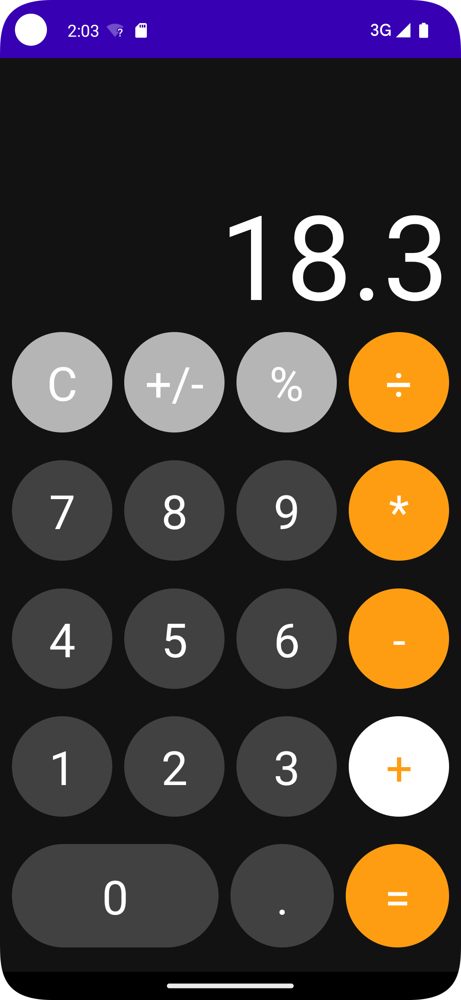
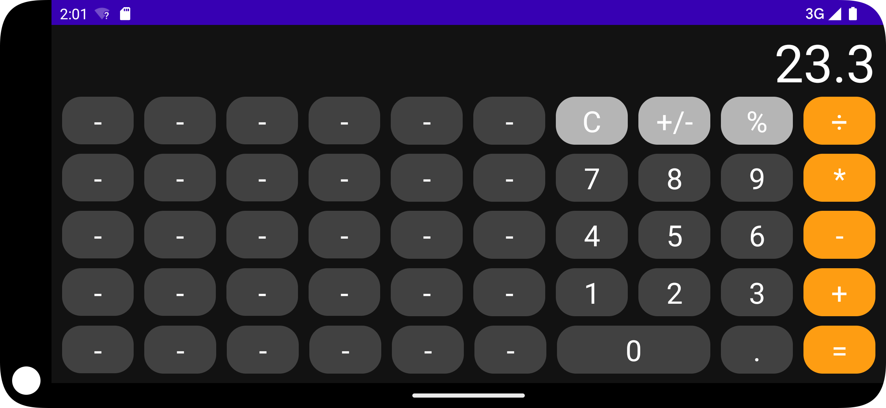

# entry_jetpack-_compose

## 用于Compose学习挑战赛

### 根据题目，我实现了一个简单的计算器

    UI布局参考了王鹏老师直播时的使用布局方式，使用逻辑跟ios手机上的计算器相近。
    计算器实现了:
    四则运算；
    clear/clearAll; 
    取反；
    百分比；
    小数；

### 计算器支持横屏布局，同时带有横屏动画,左边多列“-”按钮只是占位的控件，

### 调试的机型为Pixel 5 API 33, Pixel 4 XL API 29,

